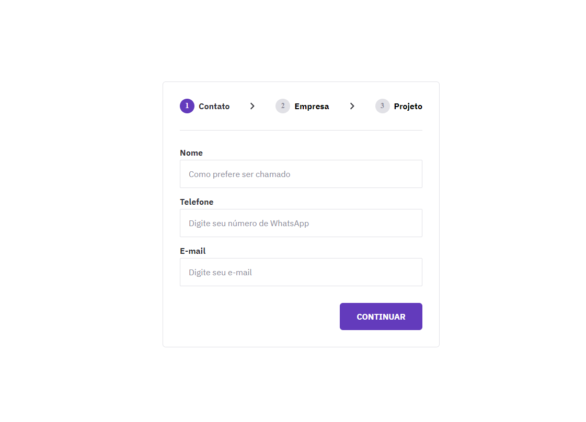

<h1 align="center"> Habits </h1>

Projeto construído no evento NLW, é um evento exclusivo e gratuito, promovido pela Rocketseat para ensino de tecnologias WEB.  

  <a href="#-tecnologias">Tecnologias</a>&nbsp;&nbsp;&nbsp;|&nbsp;&nbsp;&nbsp;
  <a href="#-projeto">Projeto</a>&nbsp;&nbsp;&nbsp;|&nbsp;&nbsp;&nbsp;
  <a href="#-layout">Layout</a>&nbsp;&nbsp;&nbsp;|&nbsp;&nbsp;&nbsp;

 

  

## 🚀 Tecnologias

Esse projeto foi desenvolvido com as seguintes tecnologias:

- HTML e CSS
- JavaScript
- Git e Github
- Figma

## 💻 Projeto

O Habits é um app para ajudar a rastrear os hábitos.

- [Visite o projeto online](https://miguelnfariass.github.io/formulario-cadastro/)

## 🔖 Layout

Você pode visualizar o layout do projeto através [DESSE LINK](<https://www.figma.com/file/a3qMGVwhIbETyLZ53bBZ8L/Formul%C3%A1rio-Multi-Step--%E2%80%A2-Desafio-23-(Community)?type=design&t=eP2TIBwHFIAMqn6Y-0>). É necessário ter conta no [Figma](https://figma.com) para acessá-lo.

## Como usar

1. Faça o download ou clone este repositório.

2. Navegue até o diretório do projeto no seu terminal.

3. Abra o arquivo `index.html` em um navegador web.

4. A tela com formulário será carregada e estará pronto para uso.

## Autor

Esse projeto foi desenvolvido por [Miguel Farias](https://github.com/miguelnfariass).

- E-mail: migueln.fariass@gmail.com
- LinkedIn: [Miguel Farias](https://www.linkedin.com/in/miguelnfarias/)

## Licença

Este projeto está sob a licença [MIT](LICENSE).
